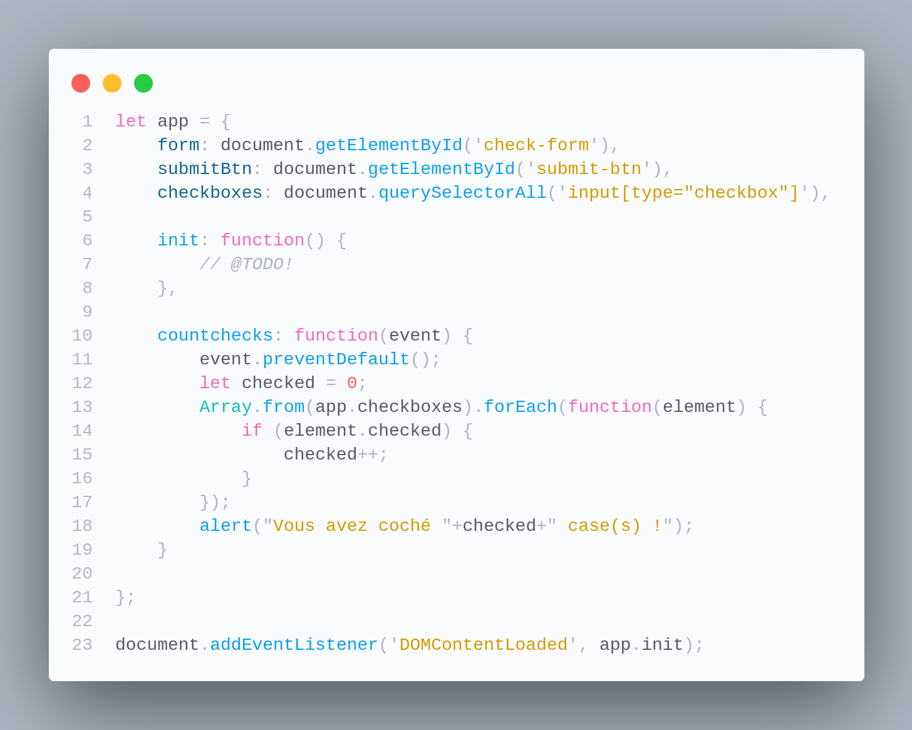

## **[3] FRONT DYNAMIQUE / JS / ASYNCHRONE / SÉCU**

### Les questions de cette section sont liées entre elles et concernent la CP 3.

#### Q3.1 - Avec tes propres mots, comment expliquerais-tu ce qu’est le DOM ?

> Ta réponse : Document Object Model, il s'agit d'une representation de la page HTML par ces "noeuds", les noeuds permettent d'accéder aux objets pour les manipuler.

&nbsp;

#### Q3.2 - Quel langage script côté client connais-tu ?

> Ta réponse : JavaScript, HTML CSS

&nbsp;

#### Q3.3 - J’ai ajouté un formulaire à ma page et ce bout de JS. Peux-tu me dire ce que fait la fonction countchecks dans l'image ci-dessous ?

> Ta réponse : Cette fonction déclenche une fonction alert à la sousmission d'un formulaire. 
> la fonction alert donne le nombre de checkbox du formualire chochées.

&nbsp;

#### Q3.4 - Maintenant, je voudrais faire en sorte que lorsqu’on clique sur le bouton d’envoi du formulaire cela déclenche la fonction countchecks. Une idée de comment faire ça ?

> Ta réponse : 

    Tu tentes un bout de code ?
    xxx
    init : function(){
        countchecks();
    }

&nbsp;

#### Q3.5 - Donner au moins un nom de techno permettant un échange client-serveur asynchrone

> Ta réponse : JavaScript, 

&nbsp;

#### Q3.6 - J’ai fait un formulaire d’inscription sur mon nouveau site. Je veux vérifier que la personne a bien renseigné le champ e-mail avant de l’inscrire réellement. Je fais ça côté serveur ou côté client ?

> Ta réponse : coté client avec un required dans les paramètres de l'input, 

&nbsp;

---

[Allez, GO la CP 5 ...](CP5.md)