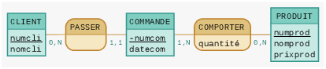
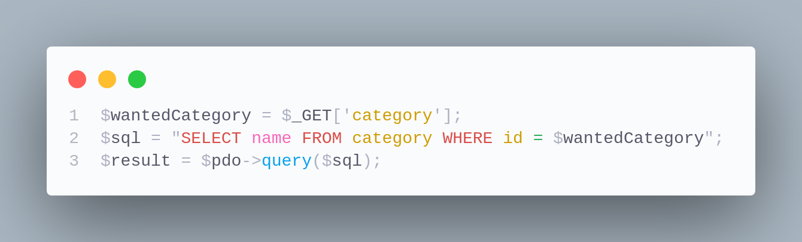

## **[6] ACCÈS AUX DONNÉES / SQL / SÉCURITÉ**

### Les questions de cette section sont liées entre elles et concernent la CP 6.

&nbsp;

#### Q6.1 - À l’aide du schéma de base de données ci-dessous, quelle requête SQL faire pour récupérer la date à laquelle a été passée la commande N°3 ? (numéro de commande = numcom)

> Ta réponse : SELECT datecom FROM commande WHERE numcom=3;

&nbsp;

#### Q6.2a - Compte tenu des cardinalités entre les tables "client" et "commande", que dois-tu ajouter et à laquelle de ces deux tables pour rendre leur relation effective ?

> Ta réponse : une clé étrangère dans commande, client_id

&nbsp;

#### Q6.2b - Maintenant que les tables "client" et "commande" sont reliées, quelle requête SQL faire pour récupérer le nom du client ayant passé la commande n°3 ?

> Ta réponse : SELECT * FROM client INNER JOIN commande ON id = commande.client_id WHERE numcom = 3; 

&nbsp;

#### Q6.3 - Quelle est la faille de sécurité présentée dans la capture d’écran ci-dessous ? Comment s’en protéger ?

> Ta réponse : j'ai fait la formation fullstack js, j'ai pas encore eu le temps de m'attaquer à PHP, au pif je dirait que le $_GET['category'] utilisé dans le WHERE n'est pas une données valable car ce n'est pas un id
> 

&nbsp;

#### Q6.4a - En PHP, que signifie PDO ?
- [ ] PHP Data Orientation
- [x ] PHP Data Objects
- [ ] PHP Database Orientation
- [ ] PHP Database Object

&nbsp;
j'ai régardé ici: https://fr.wikipedia.org/wiki/PHP_Data_Objects

#### Q6.4b - Peux-tu expliquer ce qu’est PDO et à quoi il sert ?
> Ta réponse :  c'est une extension définissant l'interface pour accéder à une base de données avec PHP.

&nbsp;

---

[C'est presque fini, on va voir la CP 7 ?](CP7.md)