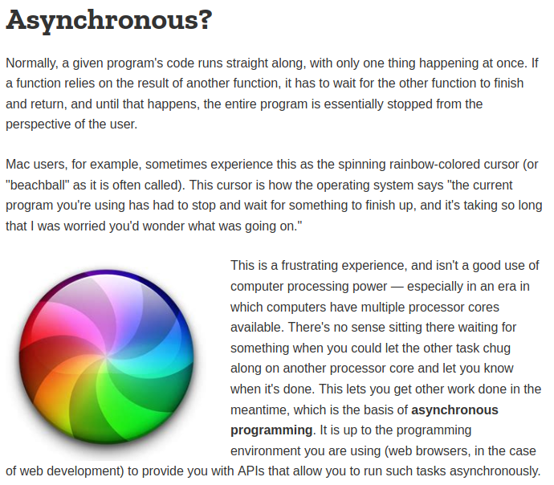

## **BONUS - L'ANGLAIS**

### Parce que l'anglais, c'est important, oui !

#### Pourrais-tu m’aider à traduire cette doc en anglais sans l’aide d’un traducteur ?

> Ta réponse :  
> Normalement lorsque le code s'execute une requête est exécutée à la fois. Si une fonction à besoin du resultat d'une autre fonction l'exécution du code doit s'arrêter jusqu'à la donnée disponible. 
> les utilisateur mac ont parfois leur curseur qui devient un rond multicolor c'est le signe que les opérations du systeme sont en train de dire 'le programme à du s'interrompre il attend que qulque'chose se termine , et cela prend du temps"
> c'est une expérience frustrante pour les utilisateur, et du gachis de processeur en particulier de nos jours ou les ordinateurs on des processeurs avec plusieurs coeurs disponibles.
> il n'y a pas de raisons valables a attendre que cette tâche s'execute alor qu'il est possible de déléguer cette taches sur un autre processeur.
> Ceci permet d'effectuer d'autre tâches simultanement, c'est ce qu'on appelle la programmation asynchrone. 
> c'est le rôle de l'environnement developpement que vous utilisez de fournir des API capable d'executer des requetes asynchrones. 

&nbsp;

---

Allez, cette fois, c'est vraiment fini. Va travailler sur ton projet 😘